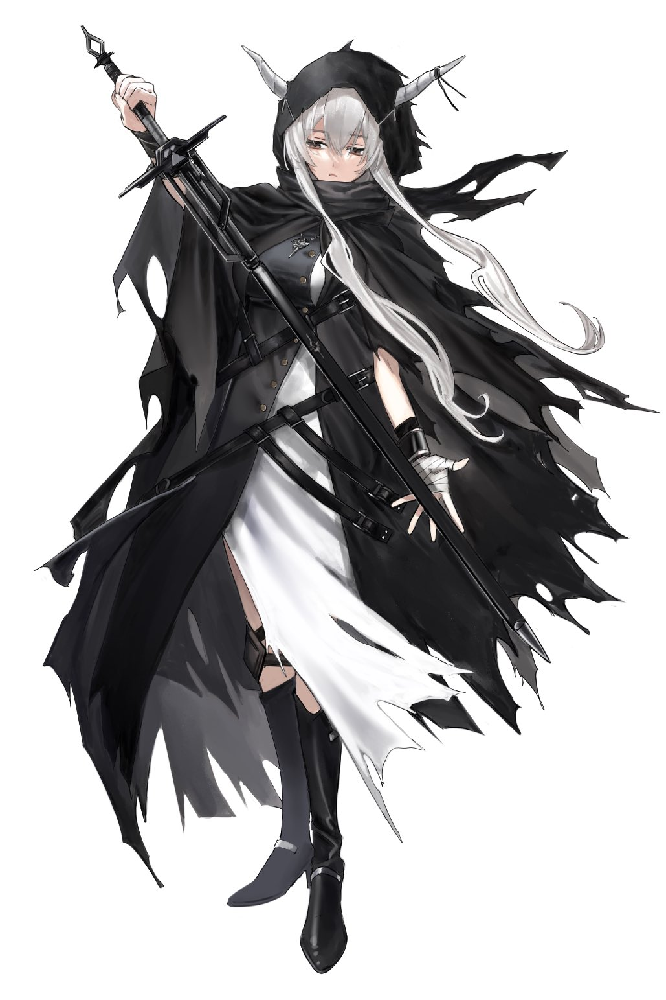

# FAQ

- [FAQ](#faq)
  - [🇷🇺 RU](#-ru)
    - [Почему NFv2?](#почему-nfv2)
  - [🇬🇧 ENG](#-eng)
    - [Why NFv2?](#why-nfv2)

## 🇷🇺 RU

- Клавиатура - 60HE+
- Монитор - 31.5" изогнутый 165гц
- Область - 99 x 55.6875
- Стиль игры - безымянный-указательный гибридный альт (иногда синглю обоими пальцами),
ховер на спиннерах/стрим практисах квадратах
- Скин - личная переделка mathi+enslada, скачать можно [тут](../files/mathi+keter.osk)
- Цепочка - Shining из Аркнайтс

Также можете скачать все мои осу коллекции в `.osdb` формате [здесь](../files/collections.zip),
чтобы работать с ними нужен [Collection Manager](https://github.com/Piotrekol/CollectionManager/releases).

### Почему NFv2?

Множество причин:

- Не приемлю получать халявные 300 за реальные 50/100 (хочется видеть *настоящую акку*)
- Больше похоже на то, что ты играешь в ритм игру, поскольку требуется аимить все слайдер тики
- Чутка верю, что помогает учиться играть слайдеры
- Намного проще сравнивать скоры между собой, особенно на стрим картах
- NF чтобы всегда получать скор для дальнейших сравнений

## 🇬🇧 ENG

- Keyboard - 60HE+
- Monitor - 31.5" curved 165hz
- Area - 99 x 55.6875
- Playstyle - ring-index hybrid alt (sometimes single with both fingers), hover on spinners/stream squares practices
- Skin - custom remake of mathi+enslada, download [here](../files/mathi+keter.osk)
- Keychain - Shining from Arknights

Also you could get my osu collections in `.osdb` format [here](../files/collections.zip), to
work with them you need [Collection Manager](https://github.com/Piotrekol/CollectionManager/releases).

### Why NFv2?

Various reasons combined:

- Can't tolerate getting free 300s on actual 50s/100s (wanna see the *true acc*)
- Have a feeling like this is a more rhythm game way to play as you should aim slider ticks properly
- Slightly believes that it helps to learn tapping sliders
- Much easier to compare scores between each other, especially on stream maps
- NF to always get scores for future comparison
